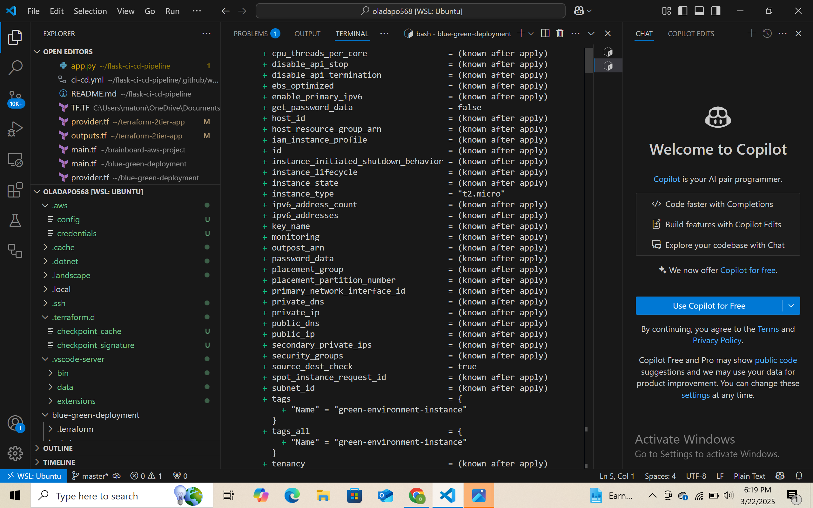
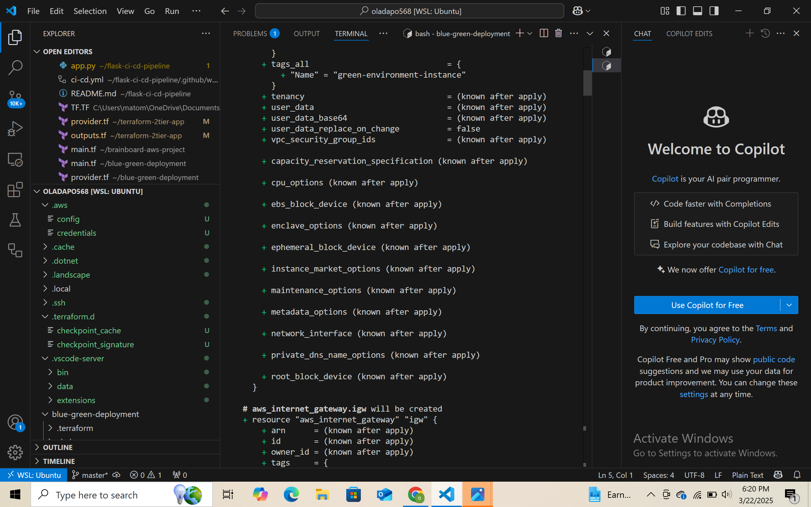
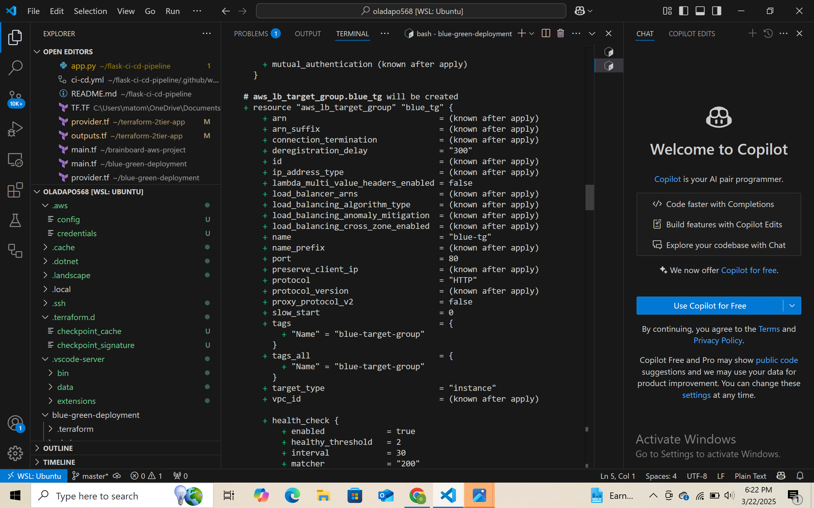
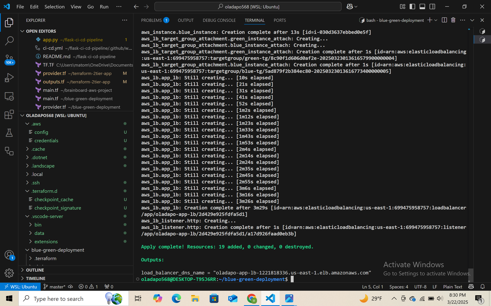
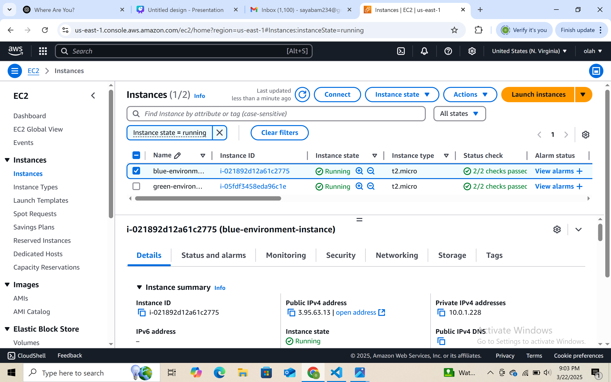

# AWS Blue-Green Deployment with Terraform and CI/CD Automation

This project demonstrates a complete Blue-Green deployment strategy on AWS using Terraform, CI/CD automation, and EC2 instances behind an Application Load Balancer (ALB).

---

## 📌 Architecture Diagram


---

## 🚀 Project Overview

- Two environments (Blue & Green) created using EC2 instances
- Application Load Balancer (ALB) controls traffic switching
- Terraform provisions all infrastructure as code
- SSH access into EC2 instances to configure Apache Web Server
- Validated Blue-Green switch via web browser

---

## 🔨 Tools & Services Used

- **Terraform**
- **AWS EC2**
- **Application Load Balancer (ALB)**
- **Security Groups**
- **Apache (httpd)**
- **Git & GitHub**

---

## 🧱 Step-by-Step Deployment

### 1. Terraform Plan Output

Planned infrastructure changes:




... *(and so on up to part9)*

---

### 2. Apply Terraform

Deployed all infrastructure including VPC, EC2, ALB, subnets, route tables.



---

### 3. View EC2 Instance Details

Retrieved public IPs for SSH access and browser testing:



---

### 4. SSH Into EC2 (Blue Instance)

Connected via SSH and installed Apache:

```bash
sudo yum update -y
sudo yum install -y httpd
sudo systemctl start httpd
sudo systemctl enable httpd


5. ALB Test – Blue & Green Pages
Verified routing to Blue environment:

Then verified routing to Green:

🔐 Security Group Setup
Allowed HTTP (80) and SSH (22):


🌀 Instance Lifecycle Snapshot
Verified deployment before Green replacement:


⚠️ Problems Faced & Solutions
Issue	Solution
SSH failed	Added correct inbound rule for port 22
No public IP	Fixed subnet settings and used associate_public_ip_address = true
ALB not routing	Corrected target group health check and listener rule
✅ Final Result
Blue and Green environments work via same DNS

ALB allows zero-downtime switch

Infrastructure fully automated with Terraform

🙋‍♂️ Author
Oladapo Adenekan
📧 Email
🔗 GitHub
🔗 LinkedIn