# 🚀 AWS Blue-Green Deployment with Terraform and CI/CD

This project showcases a hands-on implementation of **Blue-Green Deployment on AWS** using **Terraform** for Infrastructure as Code and **Apache Web Server** on EC2 instances. It includes step-by-step configuration, testing, validation, and resolution of real-world deployment challenges — all fully documented with visuals.

---

## 📌 Architecture Diagram


---

## 🛠️ Tools & Technologies

- Terraform
- AWS EC2, VPC, ALB, Security Groups
- Apache Web Server (httpd)
- Git & GitHub

---

## 🧠 Project Goals

- Create two identical environments: **Blue** and **Green**
- Configure Apache to serve unique content per environment
- Use an **Application Load Balancer (ALB)** to switch traffic
- Document every step with screenshots
- Identify and solve common infrastructure problems

---

## 📥 Step-by-Step Project Execution

### 🔹 1. Initialize Terraform & Provider Configuration

I started by setting up the AWS provider and initializing Terraform to prepare for deployment.

```hcl
provider "aws" {
  region = "us-east-1"
}
```

```bash
terraform init
```

---

### 🔹 2. Planning Infrastructure with Terraform

I executed `terraform plan` to preview resources to be created. This ensured correct configuration before deployment.

**Screenshots:**


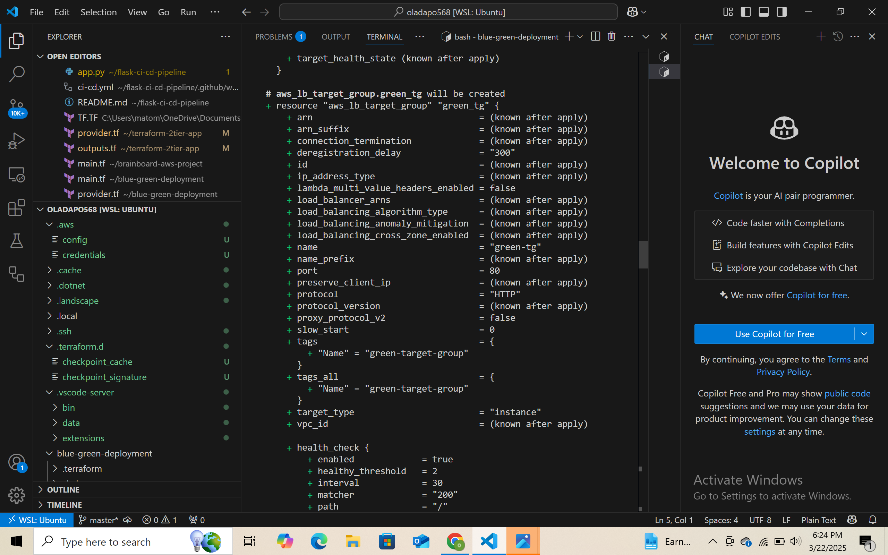
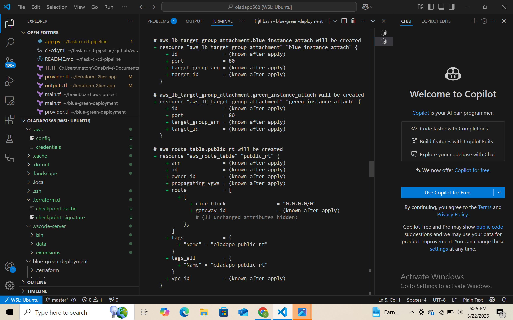
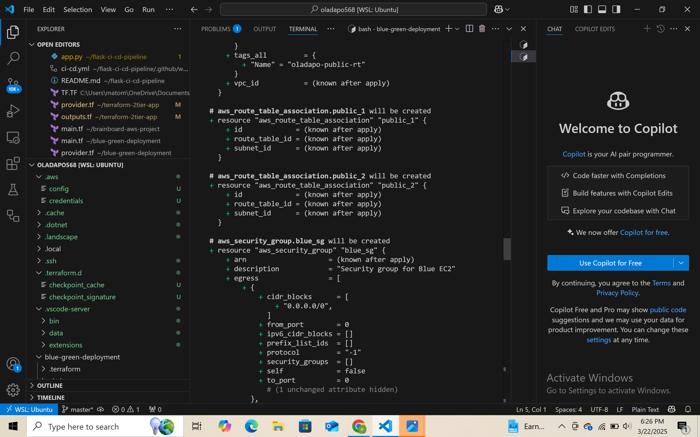
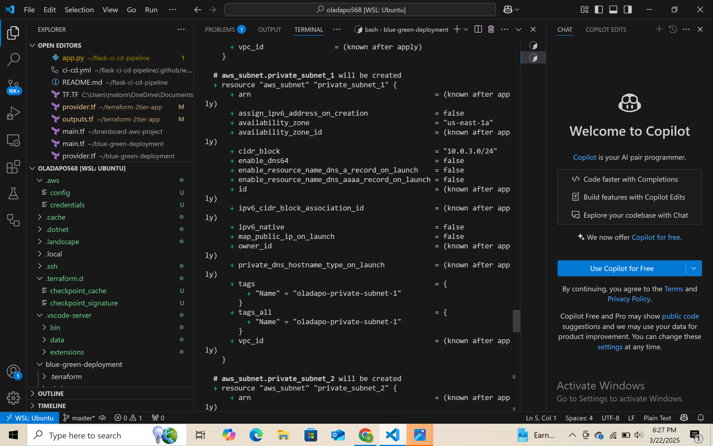
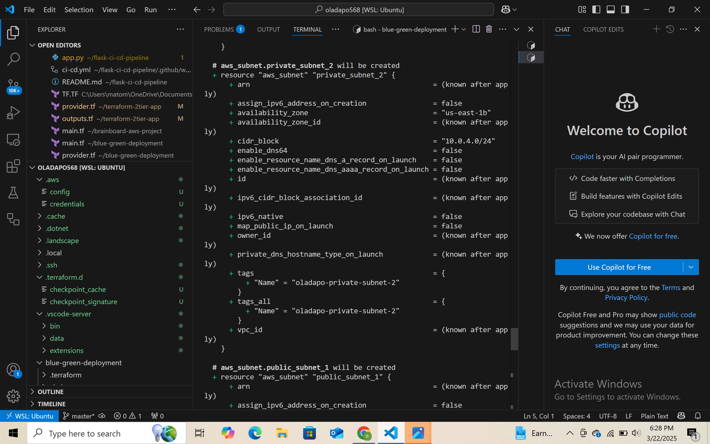
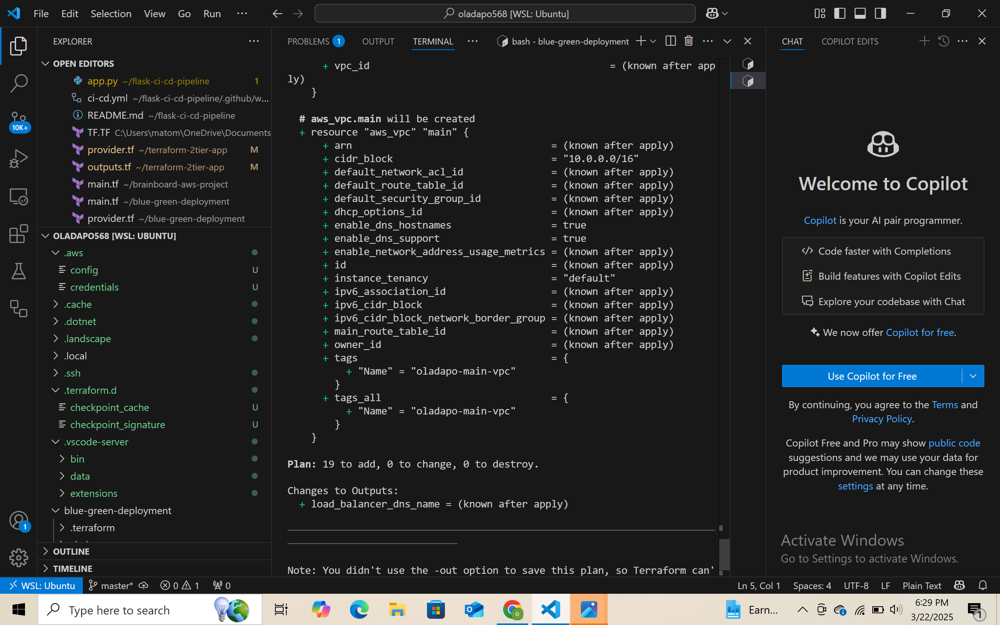

---

### 🔹 3. Applying the Terraform Infrastructure

Executed `terraform apply` to provision AWS resources: EC2, VPC, subnets, security groups, ALB, and more.

**Screenshot:**


---

### 🔹 4. Setting Up Security Group Rules

Added rules for **port 22 (SSH)** and **port 80 (HTTP)** to allow secure connections and web traffic.

**Screenshot:**
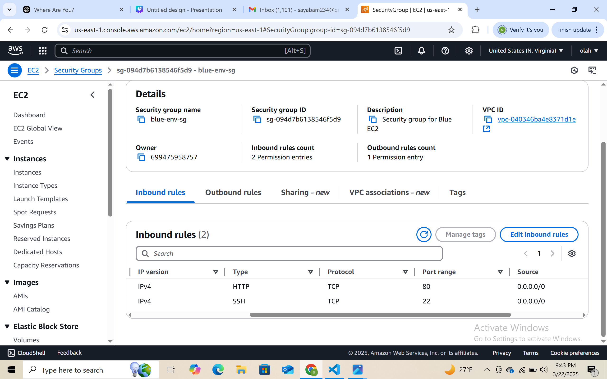

---

### 🔹 5. Verifying EC2 Instances with Public IPs

Validated the deployment of Blue and Green EC2 instances with public IPs from Terraform output.

**Screenshot:**


---

### 🔹 6. SSH Access into Blue Environment

SSH’d into the Blue instance using a key pair. This allowed access to set up the Apache web server.

**Screenshot:**
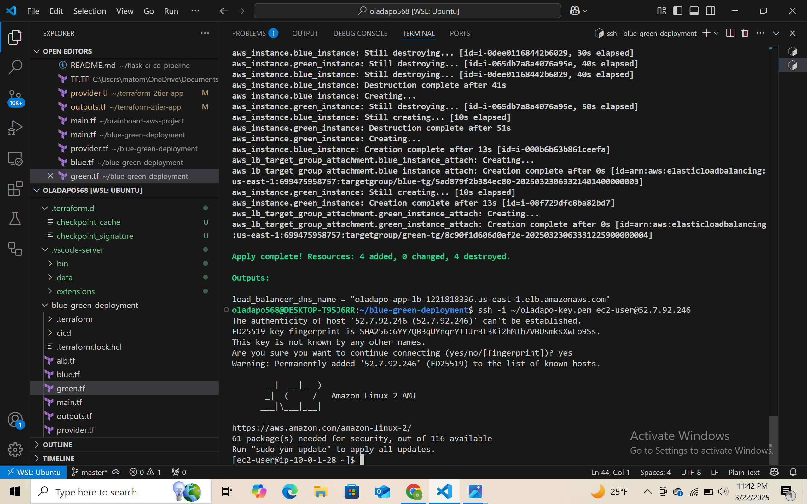

---

### 🔹 7. Installing Apache Web Server

Configured Apache via SSH and created an `index.html` page to identify the environment.

```bash
sudo yum update -y
sudo yum install httpd -y
sudo systemctl start httpd
sudo systemctl enable httpd
echo "<h1>Hello from BLUE Environment</h1>" | sudo tee /var/www/html/index.html
```

**Screenshot:**
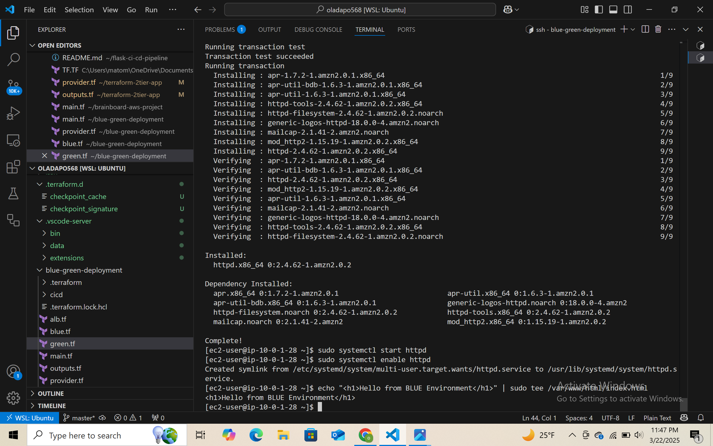

---

### 🔹 8. Validating Blue Page via ALB

Tested the Application Load Balancer URL to confirm the Blue page was correctly routed.

**Screenshot:**
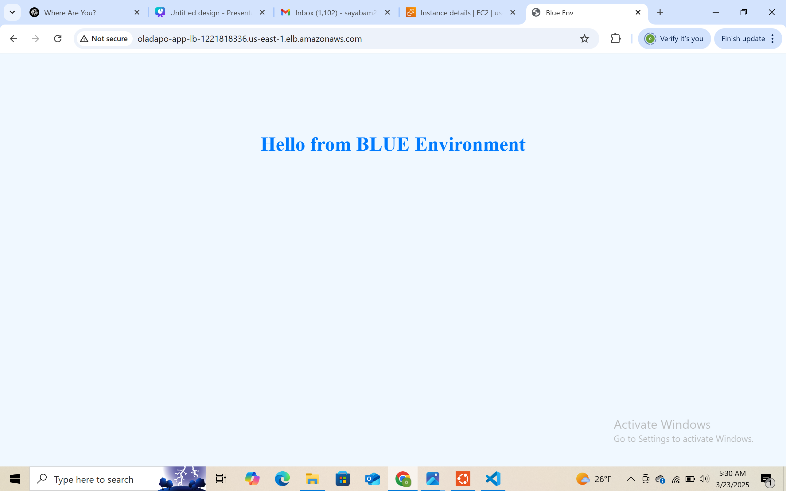

---

### 🔹 9. Switching to Green Environment

Re-applied configuration to direct traffic to the Green environment.

**Screenshot:**
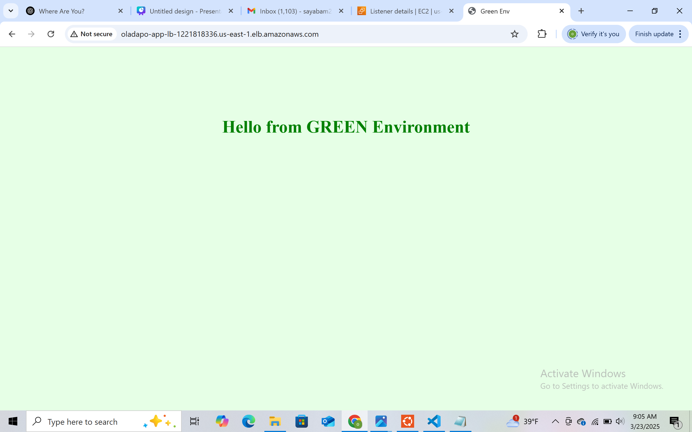

---

### 🔹 10. Instance Lifecycle Verification

Observed instance state before replacement/termination of one environment.

**Screenshot:**
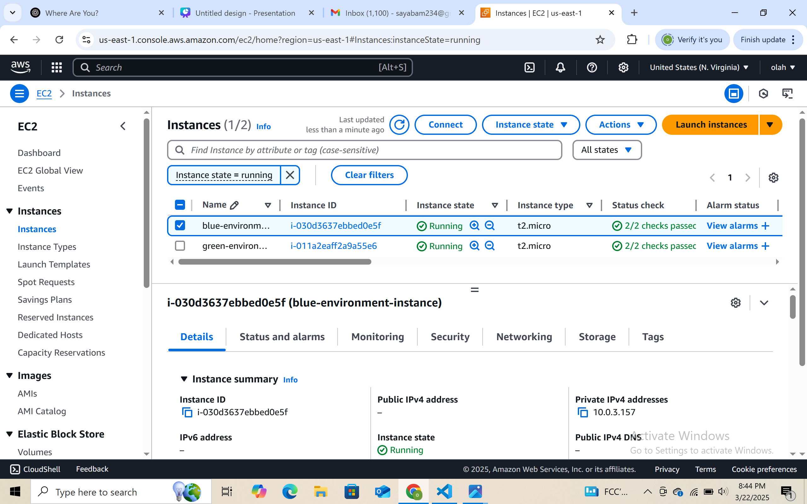

---

## ⚠️ Problems Faced & Solutions

### ❌ Issue: SSH Not Working
- **Cause:** Port 22 not open in security group
- **Fix:** Added SSH rule in the security group for inbound traffic

### ❌ Issue: No Public IP on EC2
- **Cause:** Subnet configuration was missing `map_public_ip_on_launch`
- **Fix:** Updated subnet and re-applied Terraform

**Screenshot:**


### ❌ Issue: ALB Not Routing Properly
- **Cause:** Incorrect target group health check and listener rules
- **Fix:** Modified health check path and adjusted listener configurations

---

## ✅ Final Validation

Both Blue and Green environments were successfully deployed, verified via ALB, and could be manually switched for zero-downtime deployment.

- Web servers accessible
- DNS resolution successful
- Secure traffic routing

---

## 📂 File Structure

```
blue-green-deployment/
├── main.tf
├── blue.tf
├── green.tf
├── alb.tf
├── outputs.tf
├── provider.tf
├── variables.tf
├── versions.tf
├── images/   # All screenshots & diagrams
└── README.md
```

---

## 🙋‍♂️ About Me

**Oladapo Adenekan**\
📧 [Email](mailto:adenekanoladapo302@gmail.com)\
🔗 [GitHub](https://github.com/oladapoade)\
🔗 [LinkedIn](https://www.linkedin.com/in/oladapo568)

---


